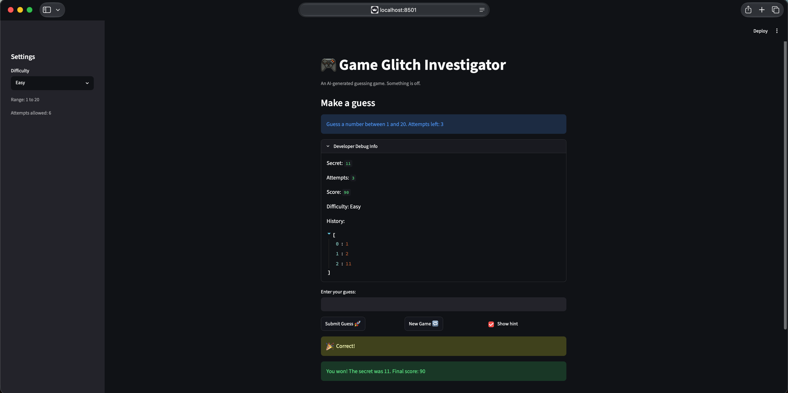

# 🎮 Game Glitch Investigator: The Impossible Guesser

## 🚨 The Situation

You asked an AI to build a simple "Number Guessing Game" using Streamlit.
It wrote the code, ran away, and now the game is unplayable.

- You can't win.
- The hints lie to you.
- The secret number seems to have commitment issues.

## 🛠️ Setup

1. Install dependencies: `pip install -r requirements.txt`
2. Run the broken app: `python -m streamlit run app.py`

## 🕵️‍♂️ Your Mission

1. **Play the game.** Open the "Developer Debug Info" tab in the app to see the secret number. Try to win.
2. **Find the State Bug.** Why does the secret number change every time you click "Submit"? Ask ChatGPT: *"How do I keep a variable from resetting in Streamlit when I click a button?"*
3. **Fix the Logic.** The hints ("Higher/Lower") are wrong. Fix them.
4. **Refactor & Test.** - Move the logic into `logic_utils.py`.
   - Run `pytest` in your terminal.
   - Keep fixing until all tests pass!

## 📝 Document Your Experience

- **Game Purpose**:
  This is a number guessing game where you try to guess a secret number within a certain range based on the difficulty level (Easy: 1-20, Normal: 1-100, Hard: 1-500) before you run out of attempts.
- **Bugs Found**:

  - The hints were backwards (guessing too high told you to go higher, and guessing too low told you to go lower).
  - The difficulty range was always stuck at 1-100, ignoring whatever you selected in the sidebar.
  - The scoring system was confusing: it used odd/even attempts to randomly add or subtract points, and allowed the score to drop below zero.
  - Invalid inputs (like text or decimals) and duplicate guesses took away attempts and polluted the guess history.
  - Hints and results disappeared instantly when the page rerun because they weren't saved in Streamlit's session state.
- **Fixes Applied**:

  - Fixed the logic in `logic_utils.py` so hints guide the player in the correct direction.
  - Updated the difficulty ranges to change dynamically and reset the game properly when a new difficulty is chosen.
  - Simplified the scoring logic so players lose a consistent 2 points per incorrect guess (never dropping below 0) and get a fair bonus for winning quickly.
  - Added input validation to catch invalid entries and duplicate guesses, showing warning messages without wasting attempts.
  - Used Streamlit session state to save hints, messages, and statuses so they persist nicely across page reruns.

## 📸 Demo Walkthrough

Here is a step-by-step example of playing the fixed game on Normal difficulty (range 1-100, secret number is 42):

1. **User enters a guess of 50**: The game returns `📉 Go LOWER!` and the attempts counter drops from 8 to 7.
2. **User enters a guess of 30**: The game returns `📈 Go HIGHER!` and the attempts counter drops to 6.
3. **User enters "abc"**: The game shows a warning `That is not a number.` without consuming any attempts.
4. **User enters a duplicate guess of 30**: The game displays `You already guessed 30. Try a different number.` without consuming any attempts.
5. **User enters a guess of 42**: The game displays `🎉 Correct! You won! The secret was 42. Final score: 90` and triggers celebratory balloons on screen.
6. If clicked submit again it shows: "You already won. Start a new game to play again."



## 🧪 Test Results

```bash
(.venv) roop@Roops-Mac-mini tests % pytest test_game_logic.py 
================================================================== test session starts ==================================================================
platform darwin -- Python 3.13.13, pytest-9.0.3, pluggy-1.6.0
rootdir: /Users/roop/Documents/Codepath/ai110-module1show-gameglitchinvestigator-starter/tests
plugins: anyio-4.13.0
collected 70 items                                                                                                                                  

test_game_logic.py ......................................................................                                                         [100%]

================================================================== 70 passed in 0.02s ===================================================================
```

## 🚀 Stretch Features

* [ ] [If you choose to complete Challenge 4, describe the Enhanced UI changes here — a screenshot is optional]
